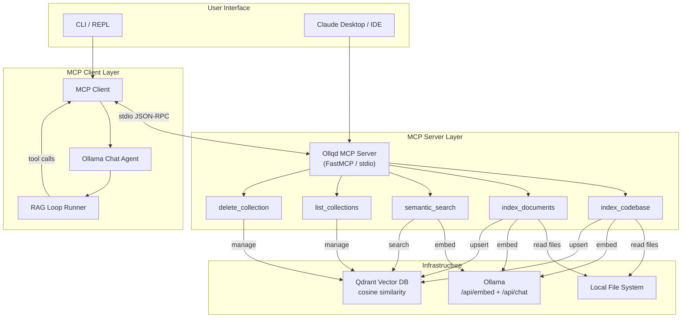
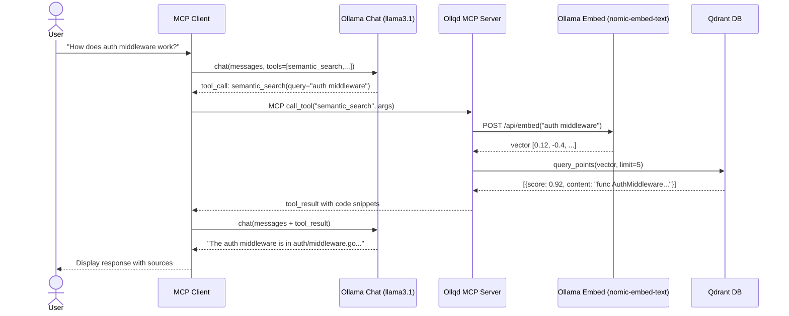
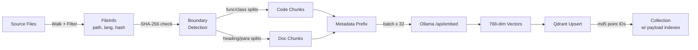
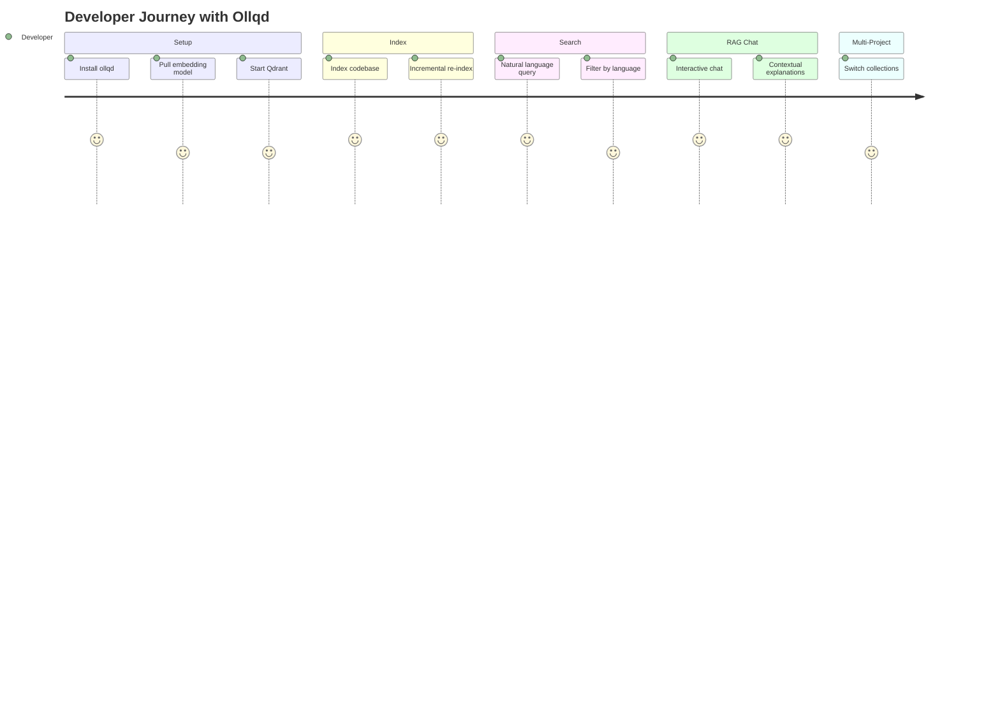

# Ollqd Design Document

> MCP Client-Server RAG System — Ollama + Qdrant
> Designed collaboratively by: Claude Opus 4.6, Gemini 3 Flash, Qwen3-Coder 480B, DeepSeek V3.2, Mistral Large 3, Devstral 2, Cogito 2.1, Kimi K2-Thinking, Gemini 3 Pro, GLM-4.7, DeepSeek V3.1, OpenAI Codex

---

## 1. Executive Summary

**Ollqd** is a local-first MCP client-server RAG system that indexes codebases and documents into Qdrant using Ollama embeddings. It enables AI assistants to perform semantic search over private data without sending it to third-party APIs.

The system consists of:
- **MCP Server** (FastMCP): Exposes 5 tools for indexing, searching, and managing vector collections
- **MCP Client**: Connects to the server via stdio, uses Ollama for chat with tool-calling, implements the full RAG loop
- **Infrastructure**: Ollama (local embeddings + LLM) + Qdrant (vector storage)

---

## 2. Architecture

### System Overview



### RAG Sequence Flow



### Indexing Data Flow



### User Journey



---

## 3. File Structure

```
ollqd/
├── pyproject.toml
├── ollqd.toml                    # Default config
├── docker-compose.yml
├── README.md
├── DESIGN.md
├── src/
│   └── ollqd/
│       ├── __init__.py
│       ├── config.py             # AppConfig dataclass + loader
│       ├── errors.py             # Exception hierarchy
│       ├── models.py             # FileInfo, Chunk, SearchResult, IndexingStats
│       ├── chunking.py           # Code-aware + document chunking
│       ├── embedder.py           # OllamaEmbedder (reused from codebase_indexer.py)
│       ├── vectorstore.py        # QdrantManager (reused from codebase_indexer.py)
│       ├── discovery.py          # File discovery (reused from codebase_indexer.py)
│       ├── server/
│       │   ├── __init__.py
│       │   └── main.py           # FastMCP server with 5 tools
│       └── client/
│           ├── __init__.py
│           ├── mcp_bridge.py     # MCP session over stdio
│           ├── ollama_agent.py   # Ollama chat with tool-calling
│           ├── rag_loop.py       # RAG loop runner
│           └── main.py           # CLI entry point
└── tests/
    ├── test_chunking.py
    ├── test_embedder.py
    ├── test_vectorstore.py
    └── test_server.py
```

---

## 4. Tool API Reference

### index_codebase

| Parameter | Type | Default | Description |
|-----------|------|---------|-------------|
| root_path | string | required | Absolute path to codebase |
| collection | string | "codebase" | Qdrant collection name |
| incremental | boolean | true | Only re-index changed files |
| chunk_size | integer | 512 | Tokens per chunk |
| chunk_overlap | integer | 64 | Overlap tokens |
| extra_skip_dirs | string[] | [] | Additional dirs to skip |

### index_documents

| Parameter | Type | Default | Description |
|-----------|------|---------|-------------|
| paths | string[] | required | File/directory paths |
| collection | string | "documents" | Collection name |
| chunk_size | integer | 512 | Tokens per chunk |
| source_tag | string | "docs" | Tag for source tracking |

### semantic_search

| Parameter | Type | Default | Description |
|-----------|------|---------|-------------|
| query | string | required | Natural language query |
| collection | string | "codebase" | Collection to search |
| top_k | integer | 5 | Number of results |
| language | string? | null | Filter by language |
| file_path | string? | null | Filter by file path |

### list_collections

No parameters. Returns list of collection names with point counts.

### delete_collection

| Parameter | Type | Default | Description |
|-----------|------|---------|-------------|
| collection | string | required | Collection to delete |
| confirm | boolean | required | Must be true to proceed |

---

## 5. Security Analysis (STRIDE)

### Spoofing
- **Threat**: Fake MCP client/server on stdio
- **Mitigation**: Process isolation, validate parent PID

### Tampering
- **Threat**: Path traversal (`../../../etc/passwd`), embedding poisoning
- **Mitigation**: Canonical path resolution, allowlist directories, SHA-256 integrity checks

### Repudiation
- **Threat**: Unlogged indexing/search operations
- **Mitigation**: Structured logging with timestamps, session IDs, file hashes

### Information Disclosure
- **Threat**: Secrets in embeddings, Qdrant exposed without auth
- **Mitigation**: Content filtering (skip .env/secrets), bind Qdrant to 127.0.0.1

### Denial of Service
- **Threat**: Large files crash Ollama, rate limiting bypass
- **Mitigation**: MAX_FILE_SIZE=512KB, asyncio.Semaphore for concurrent requests, memory limits

### Elevation of Privilege
- **Threat**: Code execution via device files, admin operations
- **Mitigation**: File type validation, least privilege, `confirm=true` for destructive ops

---

## 6. Configuration

### Environment Variables

| Variable | Default | Description |
|----------|---------|-------------|
| OLLAMA_URL | http://localhost:11434 | Ollama base URL |
| QDRANT_URL | http://localhost:6333 | Qdrant REST URL |
| OLLAMA_CHAT_MODEL | qwen2.5:14b | Chat model for RAG |
| OLLAMA_EMBED_MODEL | nomic-embed-text | Embedding model |
| OLLAMA_TIMEOUT_S | 120 | Request timeout |
| CHUNK_SIZE | 512 | Default chunk size (tokens) |
| CHUNK_OVERLAP | 64 | Default overlap (tokens) |
| MAX_TOOL_ROUNDS | 6 | Max tool-calling rounds |

### ollqd.toml

```toml
[ollama]
host = "http://localhost:11434"
chat_model = "qwen2.5:14b"
embed_model = "nomic-embed-text"
timeout = 120

[qdrant]
host = "http://localhost:6333"
default_collection = "codebase"

[indexing]
chunk_size = 512
chunk_overlap = 64

[server]
name = "ollqd-rag-server"
transport = "stdio"

[client]
max_tool_rounds = 6
```

---

## 7. Embedding Model Comparison

| Model | Dims | Speed | Code Quality | Notes |
|-------|------|-------|-------------|-------|
| nomic-embed-text | 768 | Fast | Good | Default, balanced |
| mxbai-embed-large | 1024 | Moderate | Excellent | Best for code |
| all-minilm | 384 | Very fast | Fair | Low memory |
| snowflake-arctic-embed | 1024 | Moderate | Excellent | Code-optimized |
| qwen3-embedding:0.6b | 1024 | Fast | Good | Multilingual |

---

## 8. Optimal Chunk Sizes

| Content Type | Chunk Size | Overlap | Strategy |
|-------------|-----------|---------|----------|
| Code (40+ langs) | 512 tokens | 64 tokens | Function/class boundaries |
| Markdown | 1024 tokens | 128 tokens | Heading hierarchy |
| PDF | 800 tokens | 100 tokens | Page + paragraph |
| Plain text | 1024 tokens | 128 tokens | Paragraph groups |
| JSON/YAML | 1500 tokens | 0 | Single chunk if small |
| Jupyter | 800 tokens | 100 tokens | Cell-based splits |

---

## 9. Testing Strategy

### Unit Tests
- Chunking: boundary detection for all 40+ languages
- Embedder: dimension probing, batch processing
- VectorStore: collection CRUD, upsert, search, incremental hashing

### Integration Tests
- End-to-end: index small codebase → search → verify results
- MCP protocol: tool discovery, call, response cycle

### Mocks
- Ollama: mock /api/embed with fixed 768-dim vectors
- Qdrant: mock QdrantClient with in-memory storage
- File system: tempdir with sample code files

### Edge Cases
- Empty files, binary files, files > 512KB
- Unicode filenames and content
- Permission errors, symlinks
- Qdrant/Ollama connection failures
