# Diagrams

All diagrams use Mermaid syntax and render in GitHub, VS Code, and any Mermaid-compatible viewer.

---

## 1. System Architecture

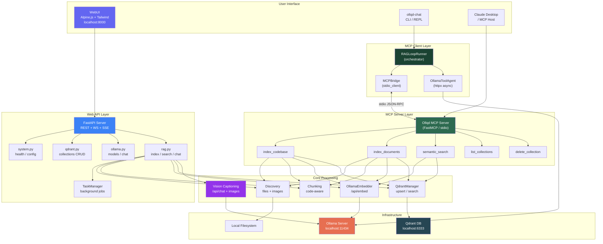

---

## 2. WebUI RAG Chat Sequence

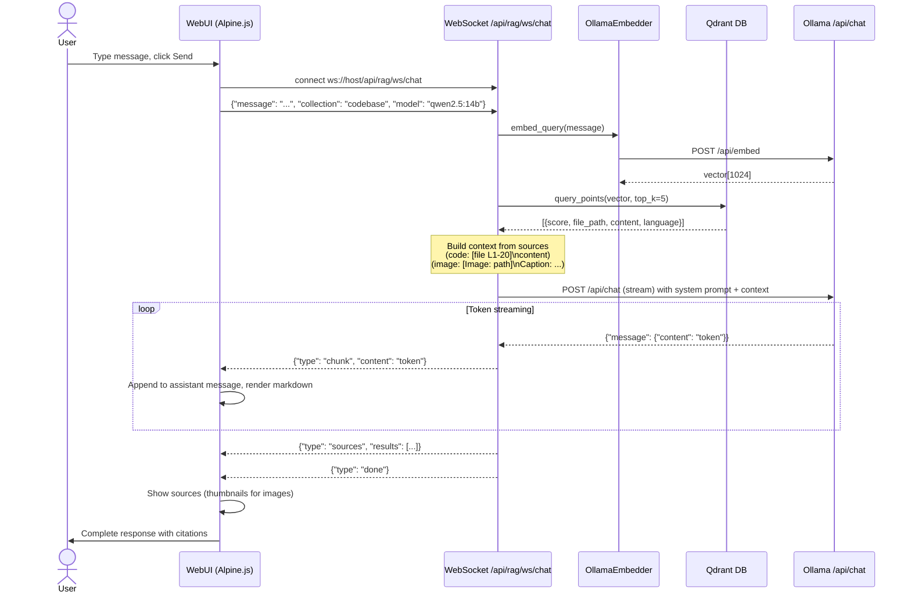

---

## 3. MCP CLI RAG Sequence

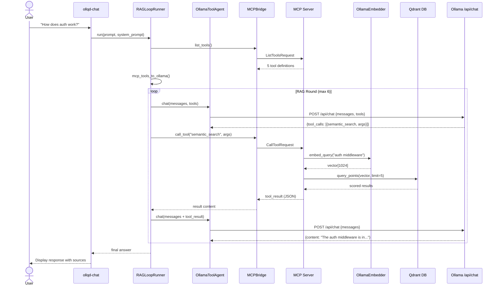

---

## 4. Codebase Indexing Pipeline

```mermaid
flowchart LR
    subgraph "1. Discovery"
        ROOT["Root<br/>Directory"] --> WALK["os.walk()<br/>recursive"]
        WALK --> FILTER["Filter:<br/>extensions (40+)<br/>skip dirs<br/>skip files<br/>max 512KB"]
        FILTER --> HASH["SHA-256<br/>hash"]
        HASH --> FI["FileInfo[]"]
    end

    subgraph "2. Incremental"
        FI --> INCR{"incremental?"}
        INCR -->|Yes| COMPARE["Compare hashes<br/>vs Qdrant"]
        COMPARE --> CHANGED["Changed only"]
        COMPARE --> DEL["Delete stale"]
        INCR -->|No| ALL["All files"]
    end

    subgraph "3. Chunking"
        CHANGED & ALL --> CHUNK["Code-Aware<br/>Chunking"]
        CHUNK --> BOUNDARY{"Boundary?<br/>def/class/fn"}
        BOUNDARY -->|Yes| SPLIT["Split at<br/>boundary"]
        BOUNDARY -->|No/budget| FORCE["Force split<br/>with overlap"]
        SPLIT & FORCE --> CHUNKS["Chunk[]"]
    end

    subgraph "4. Embedding"
        CHUNKS --> PREFIX["Metadata<br/>prefix"]
        PREFIX --> BATCH["Batch x 32"]
        BATCH --> OLLAMA["/api/embed"]
        OLLAMA --> VECS["float[1024]"]
    end

    subgraph "5. Storage"
        VECS --> POINTS["PointStruct"]
        POINTS --> UPSERT["Qdrant<br/>upsert"]
        UPSERT --> DONE["Indexed"]
    end

    style ROOT fill:#e76f51,color:#fff
    style DONE fill:#2d6a4f,color:#fff
```

---

## 5. Image RAG Pipeline

```mermaid
flowchart LR
    subgraph "1. Discovery"
        IROOT["Image<br/>Directory"] --> IWALK["os.walk()"]
        IWALK --> IFILTER["Filter:<br/>.png .jpg .jpeg<br/>.gif .webp .bmp<br/>.tiff<br/>max 10MB"]
        IFILTER --> IHASH["SHA-256 hash"]
        IHASH --> IDIM["Pillow<br/>dimensions<br/>(optional)"]
        IDIM --> IMG["ImageFileInfo[]"]
    end

    subgraph "2. Incremental"
        IMG --> IINCR{"incremental?"}
        IINCR -->|Yes| ICOMP["Compare hashes"]
        ICOMP --> ICHANGED["Changed only"]
        IINCR -->|No| IALL["All images"]
    end

    subgraph "3. Captioning"
        ICHANGED & IALL --> B64["Base64<br/>encode"]
        B64 --> VISION["/api/chat<br/>+ images[]<br/>(llava:7b)"]
        VISION --> CAPTION["Text<br/>caption"]
    end

    subgraph "4. Embedding"
        CAPTION --> CTEXT["'Image: path<br/>Caption: ...'"]
        CTEXT --> IEMBED["/api/embed"]
        IEMBED --> IVEC["float[1024]"]
    end

    subgraph "5. Storage"
        IVEC --> IPOINT["PointStruct<br/>language='image'<br/>caption, abs_path"]
        IPOINT --> IUPSERT["Qdrant<br/>upsert"]
        IUPSERT --> IDONE["Indexed"]
    end

    style IROOT fill:#9333ea,color:#fff
    style VISION fill:#9333ea,color:#fff
    style IDONE fill:#2d6a4f,color:#fff
```

---

## 6. Component Diagram

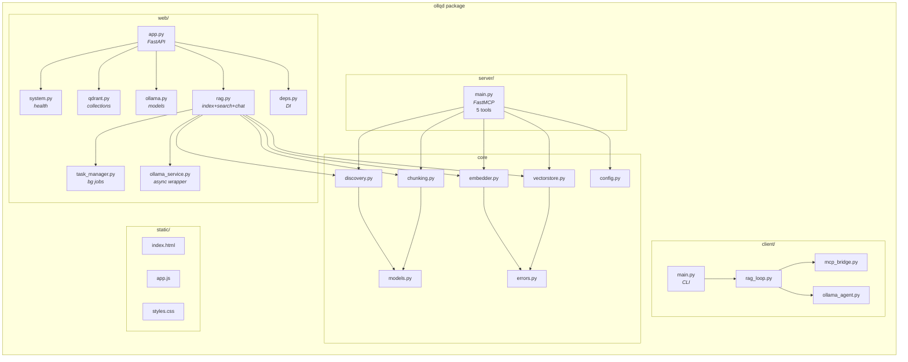

---

## 7. Deployment Diagram

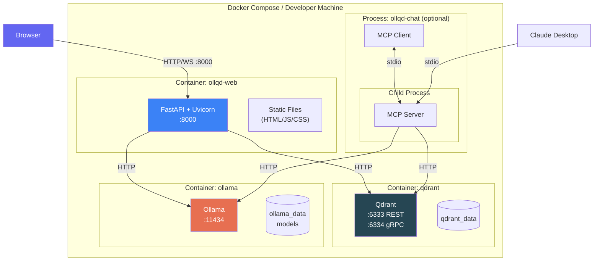

---

## 8. State Machine: Task Lifecycle

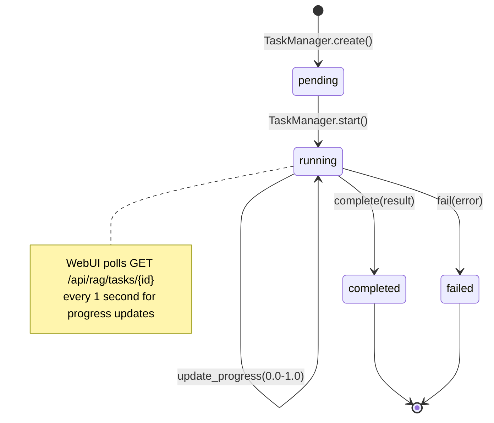

---

## 9. State Machine: RAG Chat Loop

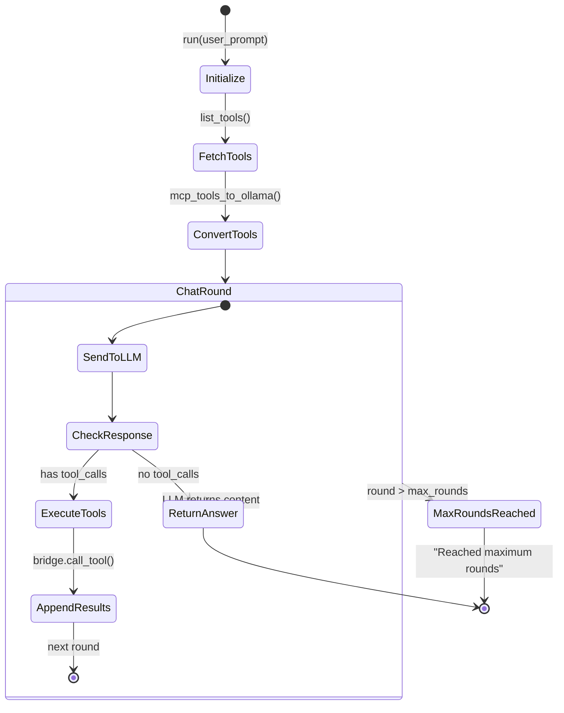

---

## 10. State Machine: Indexing Pipeline

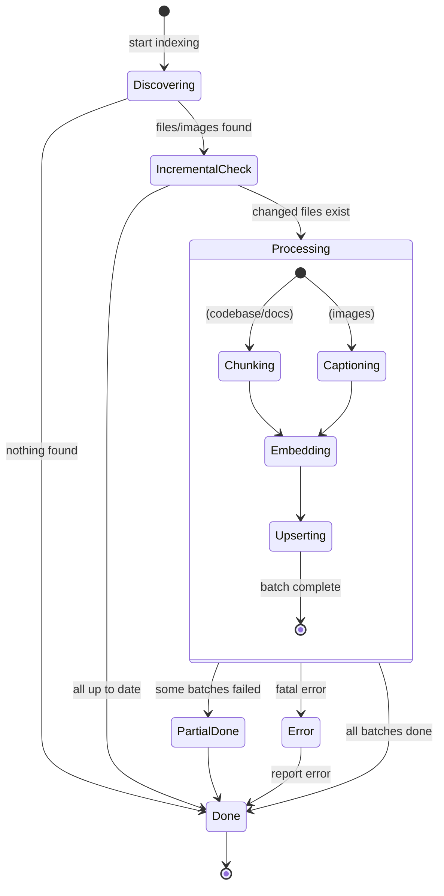

---

## 11. Chunking Decision Flowchart

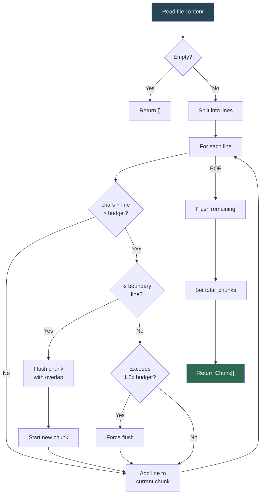

---

## 12. WebSocket Chat Protocol

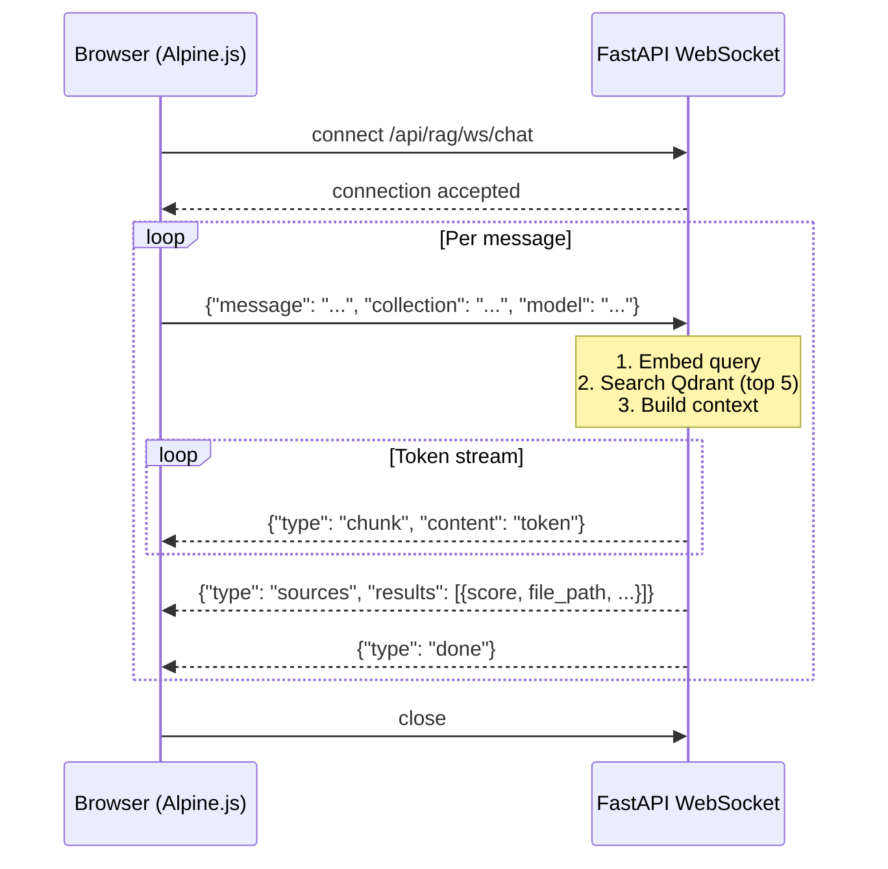

---

## 13. Model Pull SSE Stream

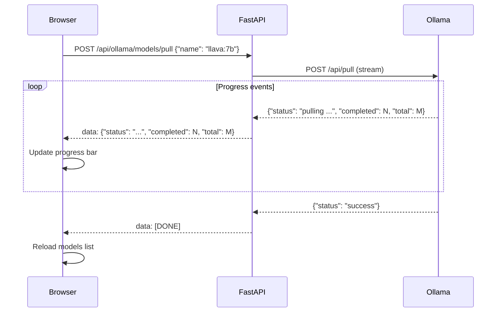

---

## 14. Boundary Detection by Language

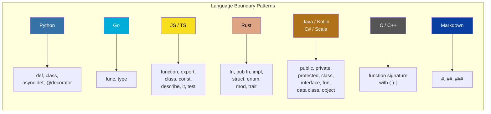
