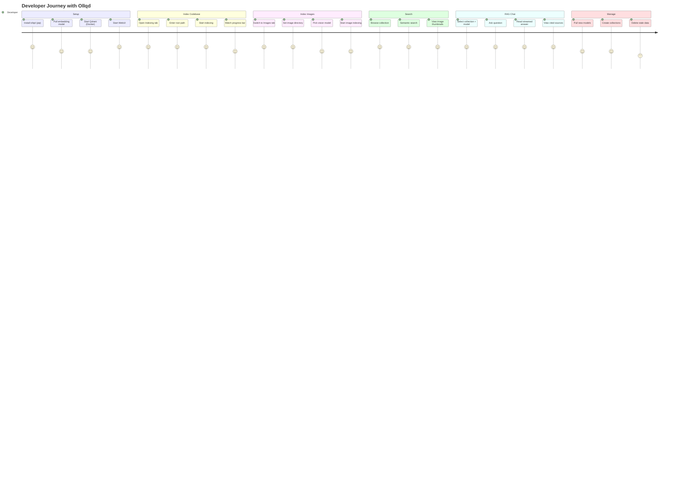

# User Flows & Journeys

## 1. User Journey Map



---

## 2. WebUI Flows

### 2.1 First-Time Setup

```
1. Install:          pip install ollqd[web]
2. Start services:   docker compose up -d qdrant ollama
3. Pull models:      ollama pull qwen3-embedding:0.6b
                     ollama pull qwen2.5:14b
4. Launch:           ollqd-web
5. Open browser:     http://localhost:8000
```

The Dashboard loads automatically showing:
- Health indicators (Ollama: up/down, Qdrant: up/down)
- Collection count, total vectors, model count
- Collections table with point counts

### 2.2 Index a Codebase

```
WebUI > Indexing > Codebase tab

1. Enter "Root Path" (e.g., /Users/me/myproject)
2. Optionally change "Collection Name" (default: "codebase")
3. Adjust chunk size/overlap if needed
4. Check "Incremental" for re-runs
5. Click "Start Indexing"

Result:
  - Task appears in Tasks panel with progress bar
  - Progress updates every ~1 second via polling
  - On completion: "N files, M chunks"
  - Collection appears in Collections view
```

### 2.3 Index Images

```
WebUI > Indexing > Images tab

1. Enter "Root Path" to image directory
2. Optionally change "Collection Name" (default: "images")
3. Select vision model from dropdown (or leave as server default: llava:7b)
4. Check "Incremental"
5. Click "Start Image Indexing"

Result:
  - Task with type "index_images" appears
  - Each image: base64 encode -> vision caption -> embed caption -> Qdrant
  - On completion: "N found, M indexed"
  - Collection with language="image" points
```

### 2.4 Browse a Collection

```
WebUI > Collections > click "Browse"

1. Points load (20 at a time, paginated)
2. Each point shows:
   - Point ID (hex)
   - Language tag
   - File path
   - Content preview (300 chars)
   - For images: thumbnail + caption
3. Click "Load more..." for next page
```

### 2.5 Search a Collection

```
WebUI > Collections > click "Search"

1. Type natural language query
2. Click "Search" or press Enter
3. Results show top-10 matches:
   - File path + relevance score (%)
   - For code: line numbers + content preview
   - For images: thumbnail + caption
```

### 2.6 RAG Chat

```
WebUI > RAG Chat

1. Select collection from dropdown
2. Select chat model from dropdown
3. Type question in input box
4. Press Enter or click Send
5. WebSocket connection opens (auto-reconnects)
6. Response streams token-by-token with blinking cursor
7. After streaming completes:
   - Sources panel shows cited files/images
   - Image sources show small thumbnails
8. Click "Clear" to reset conversation
```

### 2.7 Pull a Model

```
WebUI > Models > "Pull Model" button

1. Modal opens
2. Enter model name (e.g., "llava:7b", "qwen2.5:3b")
3. Click "Pull"
4. Progress bar shows download status
5. On completion: model appears in list
```

### 2.8 Create a Collection

```
WebUI > Collections > "Create Collection" button

1. Modal opens
2. Enter name, vector size (default: 1024), distance metric
3. Click "Create"
4. Collection appears in list
```

---

## 3. CLI Flows

### 3.1 Single Query

```bash
$ ollqd-chat "How does the auth middleware work?"

# Output:
# The authentication middleware is defined in auth/middleware.go...
# [Sources: auth/middleware.go L12-45, auth/types.go L5-20]
```

### 3.2 Interactive REPL

```bash
$ ollqd-chat --interactive

ollqd> How does error handling work?
# ... streamed response ...

ollqd> :model llama3.1
# Switched to llama3.1

ollqd> What about the database layer?
# ... response with new model ...

ollqd> :quit
```

### 3.3 Verbose Mode

```bash
$ ollqd-chat -v "query"
# Shows DEBUG logs: tool calls, bridge messages, timing
```

### 3.4 CLI RAG Loop Internals

```
1. MCPBridge spawns ollqd-server as child process (stdio)
2. List available tools (5 MCP tools)
3. Convert MCP tool schemas to Ollama format
4. Send user message + tools to Ollama /api/chat
5. If Ollama returns tool_calls:
   a. Execute each tool via MCPBridge
   b. Append tool results to conversation
   c. Send back to Ollama (next round)
6. If Ollama returns content (no tool_calls):
   a. Return as final answer
7. Max 6 rounds, then force-return last content
```

---

## 4. MCP Integration Flow

### 4.1 Claude Desktop Setup

```json
// ~/.config/claude/claude_desktop_config.json
{
  "mcpServers": {
    "ollqd": {
      "command": "ollqd-server",
      "env": {
        "OLLAMA_URL": "http://localhost:11434",
        "QDRANT_URL": "http://localhost:6333"
      }
    }
  }
}
```

### 4.2 Claude Desktop Usage

```
User: "Search my codebase for authentication logic"

Claude Desktop:
  1. Discovers ollqd tools via MCP ListTools
  2. Decides to call semantic_search(query="authentication logic")
  3. Receives code snippets with file paths and line numbers
  4. Generates response citing specific files

User: "Index this new project at /Users/me/newproject"

Claude Desktop:
  1. Calls index_codebase(root_path="/Users/me/newproject")
  2. Waits for indexing result
  3. Reports: "Indexed 42 files with 186 chunks into 'codebase' collection"
```

### 4.3 Any MCP-Compatible Host

The MCP server exposes 5 tools over stdio JSON-RPC:
- `index_codebase` — walk + chunk + embed + store
- `index_documents` — docs/markdown + chunk + embed + store
- `semantic_search` — embed query + Qdrant search
- `list_collections` — show all collections
- `delete_collection` — remove with confirmation

Any MCP host that supports stdio transport can use these tools.

---

## 5. Docker Compose Flow

### 5.1 Full Stack Launch

```bash
# Start all services
docker compose up -d

# Services:
#   qdrant:  localhost:6333 (REST), :6334 (gRPC)
#   ollama:  localhost:11434
#   web:     localhost:8000

# Pull models inside ollama container
docker exec ollama ollama pull qwen3-embedding:0.6b
docker exec ollama ollama pull qwen2.5:14b
docker exec ollama ollama pull llava:7b  # for image RAG

# Open WebUI
open http://localhost:8000
```

### 5.2 Standalone Docker

```bash
# Build image
docker build -t ollqd-web .

# Run with host services
docker run -d --name ollqd-web \
  -p 8000:8000 \
  -e OLLAMA_URL=http://host.docker.internal:11434 \
  -e QDRANT_URL=http://host.docker.internal:6333 \
  ollqd-web
```

---

## 6. Error Scenarios

| Scenario | User Sees | Resolution |
|----------|-----------|------------|
| Ollama down | Health: "down" (red) | Start Ollama: `ollama serve` |
| Qdrant down | Health: "down" (red) | Start Qdrant: `docker compose up qdrant` |
| No models | Empty model list | Pull model: WebUI > Models > Pull |
| Empty collection | "No tasks yet" | Index first: WebUI > Indexing |
| Vision model missing | Task fails with error | Pull vision model: `ollama pull llava:7b` |
| Image too large | Skipped silently | Increase `max_image_size_kb` or resize |
| WebSocket disconnect | Chat stops streaming | Refresh page (auto-reconnects) |
| Path traversal | 400/404 error | Use absolute paths to valid directories |
